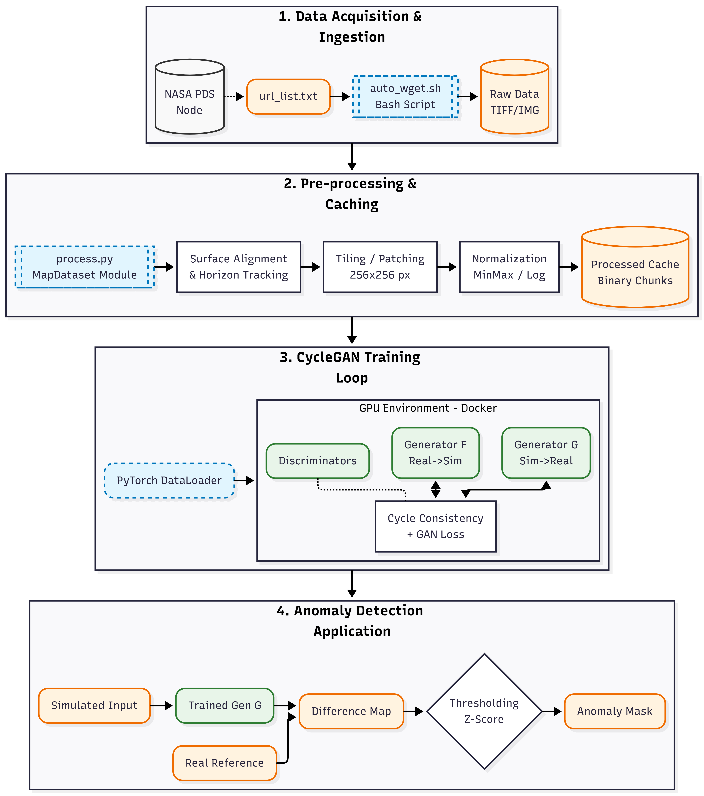
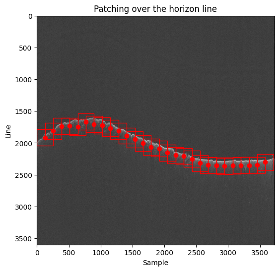
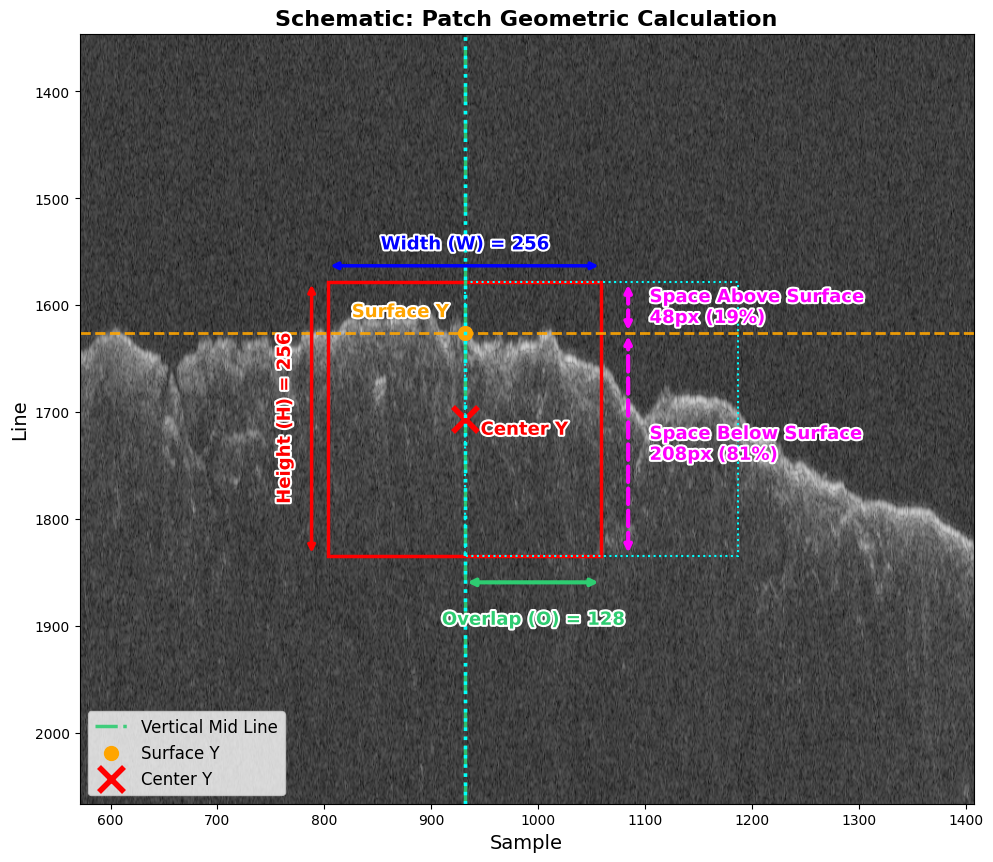

# Image-to-Image GAN Translation for Radar Sounding: Clutter and Subsurface Discrimination 📡

  
   
  <em>Conditional Generative Adversarial Networks converting between domains for unsupervised anomaly detection in planetary subsurface radar data.</em>

---

**University of Trento - Information Engineering Master's Thesis**

This repository contains the complete body of work produced for the Master's Thesis: **Image-to-Image GAN Translation for Radar Sounding**. The project explores and implements deep learning techniques—specifically conditional Generative Adversarial Networks like Pix2Pix and CycleGAN—for the unsupervised detection of anomalies within Planetary Subsurface Radar data (specifically, the SHARAD instrument on the Mars Reconnaissance Orbiter).

By reformulating anomaly detection as an image-to-image translation task from synthetic (clutter-only) to real observation domains, the framework systematically identifies subsurface reflectors embedded within complex surface clutter environments.

---

## 📂 Repository Structure

The project is structured to offer both the theoretical documentation and the practical, ready-to-use codebase:

- **[`/codebase/`](./codebase/)**: The deep learning framework built in PyTorch. It provides a highly modular architecture for training, testing, hyperparameter tuning, and visualizing state-of-the-art cGAN models. It heavily utilizes Docker to ensure a consistent research environment. *(See the `codebase/README.md` for full implementation details, setup instructions, and anomaly detection pipelines).*
- **[`/thesis/`](./thesis/)**: The complete LaTeX source code of the Master's Thesis manuscript. It includes all chapters natively split for modularity, custom Python LaTeX-refactoring utility scripts, bibliography files, and the original high-resolution vector and raster assets.
- **[`/presentation/`](./presentation/)**: Contains the thesis defense presentation and associated materials.
- **[`samuele_trainotti_IE_2324.pdf`](./samuele_trainotti_IE_2324.pdf)**: The final compiled output manuscript of the Master's Thesis itself, easily accessible from the root location.

## 🚀 Key Highlights

  
  
   
  <em>Patching methodology applied to SHARAD radargrams for deep learning ingestion.</em>

*   **Modular Architecture**: Built from the ground up to allow frictionless experimentation with various Generative models (Pix2Pix, CycleGAN) natively tailored for radar radargrams.
*   **Novel Anomaly Detection**: Implementation of multi-metric difference calculation (L1, L2, SSIM, LPIPS) with variable calculation mechanisms (pixel-level, sliding window, patch-based) between generated reconstructions and ground truth targets to isolate un-simulated subsurface features.
*   **Fully Reproducible Environment**: The codebase includes scripts for zero-friction Docker deployments alongside `.yaml` configurations for identical experiment replications.

## 🎓 Academic Context

Developed at the **University of Trento (UniTn)**, this project bridges Information Engineering with planetary science by applying cutting-edge computer vision solutions to historically challenging radar sounding interpretations. This represents a step forward from standard manual mapping or simplistic automation towards robust, perception-aware Artificial Intelligence capable of discerning deep geological boundaries on Mars and beyond.

## 📖 Citation

If you find this thesis, methodology, or codebase useful for your research, please consider citing or referencing the project. Refer to the specific `samuele_trainotti_IE_2324.pdf` details for standard attribution properties.

---
*Created and maintained by Samuele Trainotti.*
